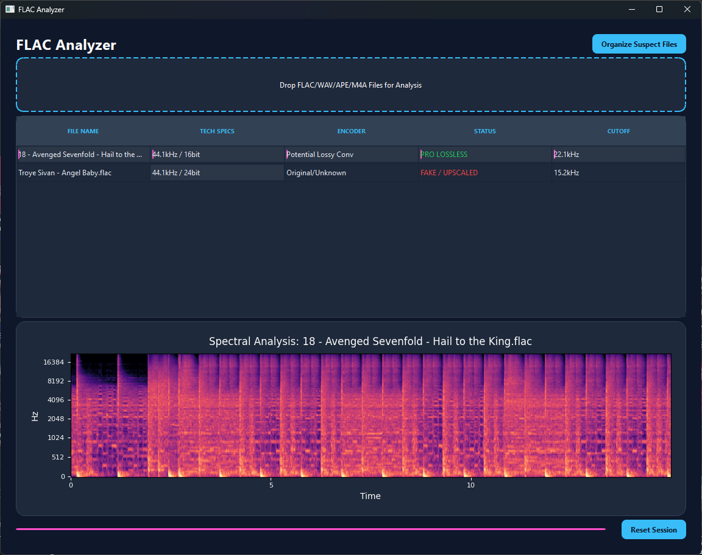

# FLAC Analyzer

A powerful desktop application for analyzing audio files (FLAC, WAV, APE, M4A) to determine their true quality and detect potential upscales or fakes.



## Features

- **Drag & Drop Interface**: Easily analyze multiple files at once.
- **Deep Metadata Analysis**: view technical specs, bitrate, and sample rate.
- **Encoder Detection**: Identifies potential lossy conversions or iTunes rips.
- **Spectral Analysis**: Visualizes the audio spectrum using a high-performance spectrogram.
- **Quality Classification**: Automatically classifies files as "PRO LOSSLESS", "MASTERING LIMIT", or "FAKE / UPSCALED" based on frequency cutoff.
- **Organization Tools**: Automatically move suspected fake files to a separate folder.
- **Context Menu Integration**: distinct options to search MusicBrainz and Discogs for release information.
- **Dark Mode UI**: A sleek, modern interface optimized for professional use.

## Requirements

- Python 3.8+
- PyQt6
- Librosa
- Matplotlib
- Mutagen
- NumPy

## Installation

It is recommended to use a virtual environment (`venv`) to manage dependencies.

1.  **Clone the repository or download the source code.**

2.  **Create a virtual environment:**

    ```bash
    # Windows
    python -m venv venv

    # macOS/Linux
    python3 -m venv venv
    ```

3.  **Activate the virtual environment:**

    ```bash
    # Windows
    .\venv\Scripts\activate

    # macOS/Linux
    source venv/bin/activate
    ```

4.  **Install dependencies:**

    ```bash
    pip install -r requirements.txt
    ```

    *If `requirements.txt` is not available, install manually:*
    ```bash
    pip install PyQt6 librosa matplotlib mutagen numpy
    ```

## Usage

1.  **Run the application:**

    ```bash
    python analyzer.py
    ```

2.  **Analyze Files:**
    - Drag and drop audio files into the designated area.
    - View the analysis results in the table.
    - Click on a file in the table to view its spectrogram.

3.  **Organize Files:**
    - Click "Organize Suspect Files" to move files flagged as "FAKE / UPSCALED" to a `_SUSPECTED_FAKE` folder in a location of your choice.

## Troubleshooting

- **Audio Backend Issues**: If you encounter issues with audio loading, ensure you have FFmpeg installed and added to your system PATH. Librosa requires FFmpeg for many audio formats.
- **PyQt6 Conflicts**: Ensure no other Qt versions are installed in the same environment to avoid conflicts.

## License

[MIT License](LICENSE)
